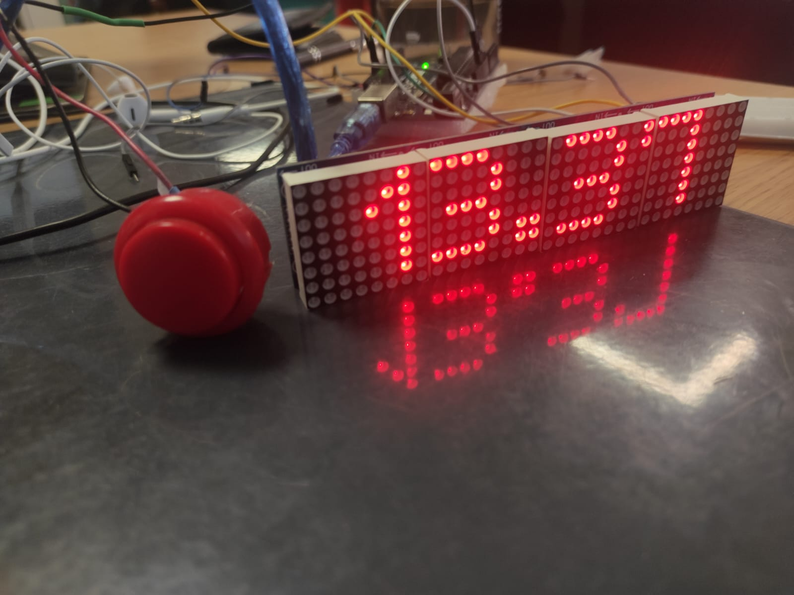

# Ready Set Time ⏱️



An arcade-style precision stopwatch and reaction timing game built with an **Arduino Uno**, a **MAX7219 4-in-1 LED Matrix (8×32)**, an arcade pushbutton, and an active buzzer.

Designed for interactive booth activations, time-guessing games, and precision stop challenges (e.g., *"hit exactly 3.77s"*).

---

## Features

- **High-Visibility Display**: 8×32 LED matrix formatted to `SS.mm` (seconds and hundredths of a second).
- **Zero Flicker**: In-place fixed-width rendering (`myDisplay.print()`) prevents jitter and character jumping.
- **One-Button Arcade Control**:
  - **Press 1**: Start timer (crisp single beep)
  - **Press 2**: Stop & lock the elapsed time (confirmation beep)
  - **Press 3**: Reset to `00.00` (double-tap *tin-tin* tone)
- **Acoustic Feedback**: Active buzzer pulsed with micro-durations to produce subtle clicks instead of harsh alarms.

---

## Hardware Requirements

| Component | Description |
| :--- | :--- |
| **Microcontroller** | Arduino Uno (or Nano / ATmega328P compatible) |
| **Display** | 4-in-1 MAX7219 Dot Matrix Module (8×32, Common Anode 1088AS) |
| **Input** | Momentary Arcade Pushbutton |
| **Audio** | 5V Active Buzzer |
| **Power** | USB 5V or external 5V power supply |

---

## Wiring Diagram

### 1. LED Matrix (Connect to the **IN** side of the module)
| Display Pin | Arduino Uno Pin | Notes |
| :--- | :--- | :--- |
| **VCC** | `5V` | |
| **GND** | `GND` | Common ground |
| **DIN** | `D11` | SPI MOSI / Data line |
| **CS** | `D10` | Chip Select |
| **CLK** | `D13` | SPI Clock |

> **Important**: Do not connect the Arduino wires to the `OUT` header. Always wire to the `IN` side.

### 2. Button & Buzzer
| Component Pin | Arduino Uno Pin | Notes |
| :--- | :--- | :--- |
| **Button (Terminal 1)** | `D6` | Configured with internal pull-up (`INPUT_PULLUP`) |
| **Button (Terminal 2)** | `GND` | |
| **Buzzer (+ / Red)** | `D5` | Driven via short digital pulses |
| **Buzzer (- / Black)**| `GND` | |

---

## Software & Dependencies

Built with [PlatformIO](https://platformio.org/) or the Arduino IDE.

### Required Libraries
- `MD_Parola` (v3.7.x or higher)
- `MD_MAX72XX` (v3.5.x or higher)
- `SPI` (Standard Arduino SPI library)

### `platformio.ini` Configuration
```ini
[env:uno]
platform = atmelavr
board = uno
framework = arduino
lib_deps =
    majicdesigns/MD_Parola
    majicdesigns/MD_MAX72XX